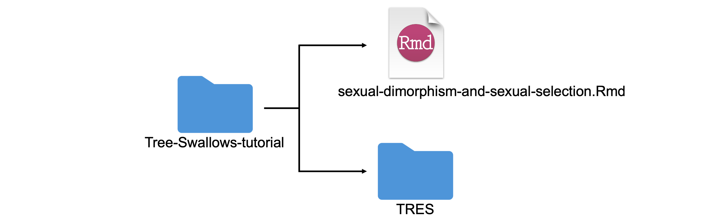

```{r setup, include=FALSE}
# DO NOT ALTER CODE IN THIS CHUNK
knitr::opts_chunk$set(echo = TRUE)

ipak <- function(pkg){
    new.pkg <- pkg[!(pkg %in% installed.packages()[, "Package"])]
    if (length(new.pkg)) 
        install.packages(new.pkg, dependencies = TRUE)
    sapply(pkg, require, character.only = TRUE)
}
packages <- c("ggplot2", "ggpubr", "dplyr", "tidyr", "lubridate", "reshape", "readr", "vembedr", "xfun", "distill")
ipak(packages)
```

### Follow along in RStudio!
 
For this tutorial, you have the option to follow along online or you can download the R Markdown file and datasets and follow along and practice coding in RStudio. To follow along in RStudio, download the following files:

```{r echo=FALSE}
xfun::embed_file('sexual-dimorphism-and-sexual-selection.Rmd', text = 'Download required RMarkdown file')
```

```{r echo=FALSE}
xfun::embed_dir('TRES/', text = 'Download required data')
```

Next, you must unzip the folder containing the datasets (TRES) and place the "tree-swallow-dataset.Rmd" R Markdown file into a new folder (e.g. folder name: "Tree-Swallows-tutorial") with the datasets folder (TRES). An example file structure is depicted below:

{.external}

NOTE: in order for this tutorial to run in RStudio, you must follow the file structure above. Your .Rmd file must be labeled "sexual-dimorphism-and-sexual-selection.Rmd" and the datasets folder must be labeled "TRES". Make sure you do not use spaces or special characters in your folder name either as good practice!

## Tutorial learning objectives

In this tutorial, you will:

- Identify if sexual dimorphism is present in a population of Tree Swallows found in Long Point, Ontario, Canada
- Explore some of the life history traits of Tree Swallows
- Evaluate trade-offs between the number of clutches a bird may have and the number of eggs in each clutch
- Evaluate how the sampled population of Tree Swallow’s birth rates have changed over time


## Background

### The dataset

Looking to explore the dataset used in this tutorial more in-depth? Check out [this tutorial](https://living-data-tutorials.github.io/website/lessons/2022-04-07-tree-swallow-dataset/index.html) where we use the Tree Swallow Dataset to learn about basic `R` functions and making plots in `R`.

The Tree Swallow (*Tachycineta bicolor*) is one of the most common birds in eastern North America that normally nests in tree cavities excavated by other species like woodpeckers, but also readily accepts human made nest boxes. Based on this quality and their abundance, Birds Canada has monitored nest boxes of Tree Swallows around the Long Point Biosphere Reserve, Ontario, Canada, from 1974 to 2014. Each summer, volunteer research assistants check nest box contents daily, and band the adults and their young. Nest-box records are available from about 300 boxes from 3-4 sites during this period. Data collected includes nest box observations, clutch initiation dates, clutch size and egg weight, nest success, weather, insect abundance, and banding data. Clutch here refers to the total eggs a bird lays in a nesting attempt. This dataset includes all data entry related to eggs, nests, nestlings, nest check observations, and banding data from 1977 to 2014. More information on this dataset can be found [here]("https://figshare.com/articles/dataset/Tree_Swallow_Nest_Box_Productivity_Dataset_from_Long-Point_Ontario_Canada_1977-2014_/14156801/1?file=26736347"). 


Additionally, in 2021, this dataset was quality checked and made open access by Jonathan Diamond through a Data Rescue internship with the [Living Data Project]("https://www.ciee-icee.ca/data.html"), an initiative through the Canadian Institute of Ecology and Evolution that rescues legacy datasets.  

Through Bird Studies Canada, Long Point Bird Observatory monitored three nest box colonies of Tree Swallows.

```{r, echo=FALSE}
# Define variable containing url
url <- "https://naturevancouver.ca/wp-content/uploads/2019/10/PeterWard_TreeSwallow.jpg"

```
<center></center>
Tree Swallows utilising a nest box. Photo by Peter Ward. Image from [Nature Vancouver]("https://naturevancouver.ca/tree-swallow-nesting-box-program/").

For this tutorial we will be looking at the banding dataset which adults were trapped sometime between the first young hatch and when they were 12 days old. All adult birds are banded, unless previously banded. Plumage color was recorded, age/sex designations were assigned, and a variety of size measurements were taken. 

*Plumage Colour*

Colour Code | Age                | Description
---         | ----               | -----------
BLU         | Blue               | More than 90% of the upper parts iridescent blue-green
INT         | Intermediate       | More than 50% up to 90% of upper parts iridescent blue-green (remainder dull brown or brown tinged with green)
BRN         | Brown              | Up to 50% of upper parts iridescent blue-green (remainder > 50% dull brown or brown tinged with green)

  
*Age Description*

Age Code    | Age                | Description
---         | ----               | -----------
JUV         | Juvenile           | a recently hatched bird, prior to it's preformative moult
HY          | Hatch Year         | a bird hatched earlier the same year
AHY         | After Hatch Year   | a bird hatched in a previous year
SY          | Second Year        | a bird in its second calendar year
ASY         | After Second Year  | a bird beyond it's second year
TY          | Third Year         | a bird in it's thrid year
ATY         | After Third Year   | a bird beyond it's third year
  

*Sex Categories*
  
Sex Code    | Sex
---         | ----
M           | Male
F           | Female


*Measurements of Size and Weight*
  
Measure        | Explanation
-----              | -------------
wing_chord         | `wing_chord` length measurement in mm
wing_flat          | `wing_flat` measurement in mm
tail               | `tail` length measurement in mm
p_9                | length of the 9th primary, or the outer primary feather, measured in mm

{.external}


Adults are blue-green above with white below with blacking flight feathers (A). First year females may be brownish above with hints of blue-green (B); adult females can be nearly blue-green as males. Photos courtesy of Max Nootbaar from the [Macaulay Library (A)]("https://macaulaylibrary.org/asset/101318791?__hstc=75100365.4b6645b395fc517502f8f060b03fdb13.1649426500778.1649426500778.1649426500778.1&__hssc=75100365.2.1649426500779&__hsfp=1238073771&_gl=1*1fqca32*_ga*NzI0MDM2MjY1LjE2NDk0MjY0OTg.*_ga_QR4NVXZ8BM*MTY0OTQyNjQ5OS4xLjEuMTY0OTQyNjU3Ny41OA..#_ga=2.227763358.2003098112.1649426500-724036265.1649426498"), [Macaulay Library (B)]("https://macaulaylibrary.org/asset/237909411?__hstc=75100365.4b6645b395fc517502f8f060b03fdb13.1649426500778.1649426500778.1649426500778.1&__hssc=75100365.3.1649426500779&__hsfp=1238073771&_gl=1*1n9uq65*_ga*NzI0MDM2MjY1LjE2NDk0MjY0OTg.*_ga_QR4NVXZ8BM*MTY0OTQyNjQ5OS4xLjEuMTY0OTQyNjg0Ni4yNg..#_ga=2.119171210.2003098112.1649426500-724036265.1649426498").


## Importing data and packages
In this tutorial, we will be working with Tree Swallow data collected by Bird Studies Canada, Long Point Bird Observatory as well as a few additional packages. Run the following code to import the required packages and pull in the dataset that we will be working with throughout this tutorial.

```{r echo = TRUE, warnings = FALSE, message = FALSE, code_folding=FALSE}
# load the following packages
library(dplyr)
library(ggplot2)
library(tidyr)
library(lubridate)
library(reshape)
library(readr)
library(ggpubr)
library(distill)

# Here we are pulling the actual datasets into R
banding <- read.csv("TRES/banding_final.csv")
banding_nest <- read.csv("TRES/banding_nest_final.csv")
nest <- read.csv("TRES/nest_final.csv")
```

Double check that the class of our data are in the correct format.

```{r echo = TRUE, code_folding=FALSE, layout="l-body-outset"}
# Now, we want to make sure the class of our data is correct before we move forward:
str(banding)

# lets go ahead and convert the sex and nest_box column class into factors:
banding$sex <- as.factor(banding$sex)
banding$nest_box <- as.factor(banding$nest_box)
str(banding_nest)
```

Now lets go ahead and fix the class of location, nest_code, and location:

```{r echo = TRUE, code_folding=TRUE}
# fix class
banding_nest$location <- as.factor(banding_nest$location)
str(banding_nest)
# fix class
nest$nest_code <- as.factor(nest$nest_code)
nest$location <- as.factor(nest$location)
```

* * *
## Sexual dimorphism in Tree Swallows

**Sexual dimorphism** is defined as the phenotypic variations within different sexes of the same species ( [Andersson and Iwasa 1998]("https://pubmed.ncbi.nlm.nih.gov/21237761/")). Differences can include size, weight, plumage (in birds). These differences are thought to arise through species that are part of a social mating system, in which there may be varying degrees of parental care ( [Darwin 1871]("http://darwin-online.org.uk/converted/pdf/1889_Descent_F969.pdf"); [Wallace 1889]("https://www.cambridge.org/core/books/darwinism/8BFFDD9B0F921EAF820ED6AF062D0CF7"); [Andersson and Iwasa 1998]("https://pubmed.ncbi.nlm.nih.gov/21237761/") ). This phenomenon is often seen in birds, where males are the larger sex and have more ornate plummage than females. 


Image from [ThoughtCo.]("https://www.thoughtco.com/peacock-facts-4690664")

***

**Questions**

*Why do you think this phenomenon happens?* 

*Why are females generally more drab?* 

*In which instance to you think females would be more ornate than males? Can you think of some examples?* 
  
***

To determine if **sexual dimorphism** exists in this Tree Swallow data we will get you to explore the average size measurements taken for each bird. Since birds were tracked using a band number, and birds may have been captured multiple times throughout their life, we will observe the differences in average size measurement taken for each bird.

```{r echo = TRUE, code_folding=TRUE}
# look at the following variable to see how they differ by gender : wing_chord, tail, and weight
# will will take the mean of these measurements by band_number and gender
wing_chord <- aggregate(wing_chord ~ band_number + sex, banding, mean)
# Boxplot of these trends based on sex
ggplot(wing_chord, aes(factor(sex), wing_chord, fill=sex)) + 
  geom_boxplot() +
  scale_fill_manual("", values=c("M"= "lightskyblue", "F"= "plum3")) + 
  xlab('') +
  ylab('Wing Chord Length (mm)') +
  ggtitle("Wing Chord Length vs. Sex") + 
  theme_bw() # this changes the background colour of the plot
```

Nice job! It looks like there is a difference between males and females in terms of wing chord measurements. Before moving forward, try measuring tail length and weight on your own. You'll see we have included what your graphs *should* look like below for both tail and weight means by sex.

**Hint:** Look at the example we just ran using the **aggregate** function first, then plot with **ggplot**.  

```{r echo = FALSE, code_folding=TRUE}
# Lets go ahead and try calculating the mean tail length and weight by sex and band number and graph boxplots of these values:
#### these are the answers ###
tail <- aggregate(tail ~ band_number + sex, banding, mean)
weight <- aggregate(weight ~ band_number + sex, banding, mean)
ggplot(tail, aes(factor(sex), tail, fill=sex)) + 
  geom_boxplot() +
  scale_fill_manual("", values=c("M"= "lightskyblue", "F"= "plum3")) + 
  xlab('') +
  ylab('Tail Length (mm)') +
  ggtitle("Tail Length vs. Sex") + 
  theme_bw() # this changes the background colour of the plot

ggplot(weight, aes(factor(sex), weight, fill=sex)) + 
  geom_boxplot() +
  scale_fill_manual("", values=c("M"= "lightskyblue", "F"= "plum3")) + 
  xlab('') +
  ylab('Weight (g)') +
  ggtitle("Bird Weight vs. Sex") + 
  theme_bw() # this changes the background colour of the plot
```


Now, to get a sense of how much the wind chord length, tail length, and weight differs between male (M) and female (F) Tree Swallows lets find the mean value for each.


```{r echo = TRUE, code_folding=TRUE}
# can calculate the mean female and male wing flat length like this (using aggregate()) or could subset by sex and then calculate
wing_chord.avg <- aggregate(wing_chord ~ sex, banding, mean)
wing_chord.avg
```

Calculate the tail and weight average on your own. Cross reference your calculations with the ones below. 

```{r echo = FALSE, code_folding=TRUE}
tail.avg <- aggregate(tail ~ sex, banding, mean)
weight.avg <- aggregate(weight ~ sex, banding, mean)
tail.avg
weight.avg
```

***


Before we head to our next section, check out this ornate mating dance between males and female birds of paradise. Note the sexual dimorphism between the males and females!

```{r echo = FALSE, message = FALSE}
library(vembedr)
embed_url("https://www.youtube.com/watch?v=nPhVOZiPokA")
```

***
**Questions**

*What is the average wing chord length, tail length, and weight of the male Tree Swallows?* 

*What is the average wing chord length, tail length, and weight of the female Tree Swallows?* 

*Do these findings suggest that there is some level of sexual dimorphism in Tree Swallows?*

*What type of pressures could lead to sexual dimorphism in Tree Swallows?* 

```{r echo = FALSE, code_folding=TRUE}
# Answers

# Male Tree Swallows:
# average wing chord length = 118.18 mm
# average tail length = 55.70 mm
# average weight = 20.76 g

# Female Tree Swallows:
# average wing chord length = 113.58 mm
# average tail length = 54.34 mm
# average weight = 20.41 g
```

* * *
## Aspects of Tree Swallow Life History

How and why do organisms evolve over time? How does natural selection, and other evolutionary forces, shape organisms over time so that they are more likely to survive and reproduce? These are some pretty big questions that **Life History Theory** tries to answer. Although we won't dive into all aspects of life history with our Tree Swallow datasets, we will explore some possible connections including: trade-offs between clutch size and clutch number, whether or not bigger birds produce larger clutches, and if clutch sizes have changed over time. 


### Trade-offs

Trade-offs exist when "*an increase in one life history trait (improving fitness) is coupled to a decrease in another life history trait (reducing fitness), so that the fitness benefit through increasing trait 1 is balanced against a fitness cost through decreasing trait 2*" ([Fabian and Flatt, 2012]("https://www.nature.com/scitable/knowledge/library/life-history-evolution-68245673/")). Traits can either be described as negative phenotypic, or genetic correlations between fitness components of individuals in a given population. Trade-offs are generally caused by limited resources, and competition for these resources, to one life history trait verses the other within an individual. For example, an organism might have a relatively short lifespan--but produce many offspring, or vice versa (think about mayflies vs. elephants for example). 

### Life history trade-offs


(Image and descriptions adapted from [Fabian and Flatt 2012]("https://www.nature.com/scitable/knowledge/library/life-history-evolution-68245673/"))

(A) A negative genetic (or phenotypic) correlation, i.e. a trade-off, between reproduction (e.g., # of eggs produced) and adult survival, one of the most commonly found negative relationships between life history traits.
  
(B) The so-called Y model of resource allocation trade-offs. In this example, a limited resource (e.g., a nutrient) is acquired and deferentially (competitively) allocated (invested) into physiological processes that affect survival at the expense of investment into reproductive functions (e.g., egg production, fecundity).
  
(C) A useful way of thinking about resource allocation trade-offs is to imagine the life history as being a pie where each pie slice represents how an organism has to allocate its resources amongst different aspects like growth, maintenance, survival, reproduction, and storage. 

To visualize whether there may be a trade off between clutch size and the number of clutches in a nest lets visualize these factors in a box plot. The `nest` dataset contains records of the clutch numbers found in nest boxes across Long Point dating back to 1987! Lets take a quick look at the dataset first to figure out what we need to plot.

```{r echo = TRUE, code_folding=TRUE}
head(nest)
```

Next, we want to look at how clutch size (`clutch_size`) may vary between the first and second clutch (`clutch_number`).

```{r echo = TRUE, code_folding=TRUE}
ggplot(nest, aes(factor(clutch_number), clutch_size)) + 
  geom_boxplot(outlier.colour="black", outlier.size=0.5, position = position_dodge(preserve = "single")) +
  xlab('Clutch Number') +
  ylab('Clutch Size') +
  ggtitle("Clutch Size vs. Clutch Number") +
  scale_y_continuous(breaks = seq(0, 13, by = 1)) +
  theme(plot.title = element_text(hjust = 0.5)) + 
  theme_bw() # this changes the background colour of the plot
```

Lets look at how we would calculate the average clutch size for clutch number 1 and 2.

```{r echo = TRUE, code_folding=TRUE, results='hide'}
aggregate(clutch_size ~ clutch_number, nest, mean)
```

***
**Question**

*What is the average clutch size for the first and second clutches?* 

```{r, echo = TRUE, code_folding=TRUE}
# Answer
# Average size for the first clutch = 5.61
# Average size for the second clutch = 4.80
```

You may have noticed that the second clutches are slightly smaller than the first clutches! However, in order to confirm that there is a statistically significant difference between the two clutch sizes you would need to complete some sort of statistical analysis (e.g a t-test).

***

### Do larger birds have bigger clutches?

Is the size and weight of the bird at maturity related to the clutch size? Lets look at wing chord length, tail length, and bird weight to investigate this and lets separate our analysis my male and female birds

First, lets find the mean wing chord length when grouped by year, nest_box, sex, clutch_number, clutch_size and band number.

```{r echo = TRUE, code_folding=TRUE}
# wing_chord
banding_nest.wing_chord <- aggregate(wing_chord ~ year + sex + nest_box + clutch_number + band_number + clutch_size, banding_nest, mean)
head(banding_nest.wing_chord)

# next, you need to double check your data are still in the right class
str(banding_nest.wing_chord)
banding_nest.wing_chord$sex <- as.factor(banding_nest.wing_chord$sex)
banding_nest.wing_chord$nest_box <- as.factor(banding_nest.wing_chord$nest_box )
```

Lets see if we see any patterns between the number of eggs there are per clutch (clutch_size) and the weight or size of the parent Tree Swallow.

```{r echo = TRUE, code_folding=TRUE}
plot(clutch_size ~ wing_chord, banding_nest.wing_chord,
     main="Clutch Size vs Parent Wing Chord Length",
     pch=20,
     col=sex,
     xlab="Wing Chord Length (mm)", 
     ylab="Clutch Size")
legend("topright", legend= levels(banding_nest.wing_chord$sex),
       col= 1:2, pch = 20, cex=0.9)
```

Now, you look at tail and weight variables. Compare your results to the results below. 

**Hint** Use similar code to the code above, but change the variables to reflect what you are intersted in looking at. 

```{r echo = FALSE, code_folding=TRUE}
# tail
banding_nest.tail <- aggregate(tail ~ year + sex + nest_box + clutch_number + band_number + clutch_size, banding_nest, mean)
# weight
banding_nest.weight <- aggregate(weight ~ year + sex + nest_box + clutch_number + band_number + clutch_size, banding_nest, mean)

# next, you need to double check your data are still in the right class
str(banding_nest.tail)
banding_nest.tail$sex <- as.factor(banding_nest.tail$sex)
banding_nest.tail$nest_box <- as.factor(banding_nest.tail$nest_box )

str(banding_nest.weight)
banding_nest.weight$sex <- as.factor(banding_nest.weight$sex)
banding_nest.weight$nest_box <- as.factor(banding_nest.weight$nest_box )


plot(clutch_size ~ tail, banding_nest.tail,
     main="Clutch Size vs Parent Tail Length",
     pch=20,
     col=sex,
     xlab="Tail Length (mm)", 
     ylab="Clutch Size")
legend("topright", legend= levels(banding_nest.tail$sex),
       col= 1:2, pch = 20, cex=0.9)
plot(clutch_size ~ weight,banding_nest.weight,
     main="Clutch size vs Parent Bird Weight",
     pch=20,
     col=sex,
     xlab="Weight (g)", 
     ylab="Clutch Size")
legend("topright", legend= levels(banding_nest.weight$sex),
       col= 1:2, pch = 20, cex=0.9)
```

## Changes through time

Could bird communities be changing over time as a result of climate change or other environmental shifts? Lets observe if the average clutch size over time is changing. First we want to take the average clutch size that was sampled from all of the nest boxes each year.

```{r echo = TRUE, code_folding=TRUE}
nest.average <- aggregate(clutch_size ~ year, nest, mean)
#Then, we'll run a linear regression to test the relationship between clutch size and year. 
lm_clutch_size <- summary(lm(clutch_size ~ year, data= nest.average))
r2_0 <- lm_clutch_size$r.squared # for R-squared labels
rlabel_0 <- bquote(italic(R)^2 == .(format(r2_0, digits = 3)))
plot(clutch_size ~ year, data=nest.average,
     main="Yearly Average Clutch Size over Time",
     pch=16,
     xlab="Year", 
     ylab="Yearly Average Clutch Size",
     cex.main=1.25, 
     cex.lab=1)
abline(lm(clutch_size ~ year, data=nest.average))
text(2010, 6.2, rlabel_0)
```

It may appear that the average clutch size is declining overtime however when looking at the $R^2$ value of this linear regression we can see that this relationship is not a strong one. $R^2$ is known as the coefficient of determination and it is a goodness of fit measure for linear regression models. Typically, we can conclude that an $R^2$ value above 0.7 indicates a strong effect size.

## Take-homes

After going through these data you have now had the opportunity to learn a bit about Tree Swallows, and more specifically look at a community of Tree Swallows found in Long Point, Ontario. This population appeared to show signs of sexual dimorphism, where the male swallows had longer wing chords and tails and were heavier. As well, we noticed that there appeared t be a trade off between clutch size and the number of clutched in a nest. An important thing to not is that these relationships were speculative and statistical analyses will be required to support these findings in this population.

Lastly, these data did not show trends of larger birds having more eggs and we observed no conclusive temporal trends of changes in birth rates over time. It is not uncommon that data is collected with certain hypotheses in mind and trend or relationships are ultimately not found to support these hypotheses!