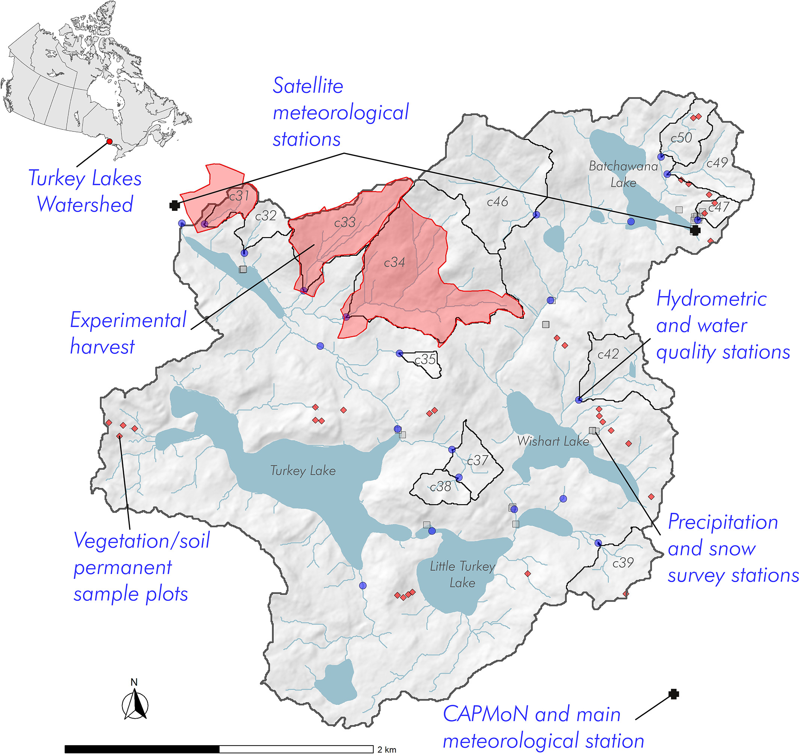
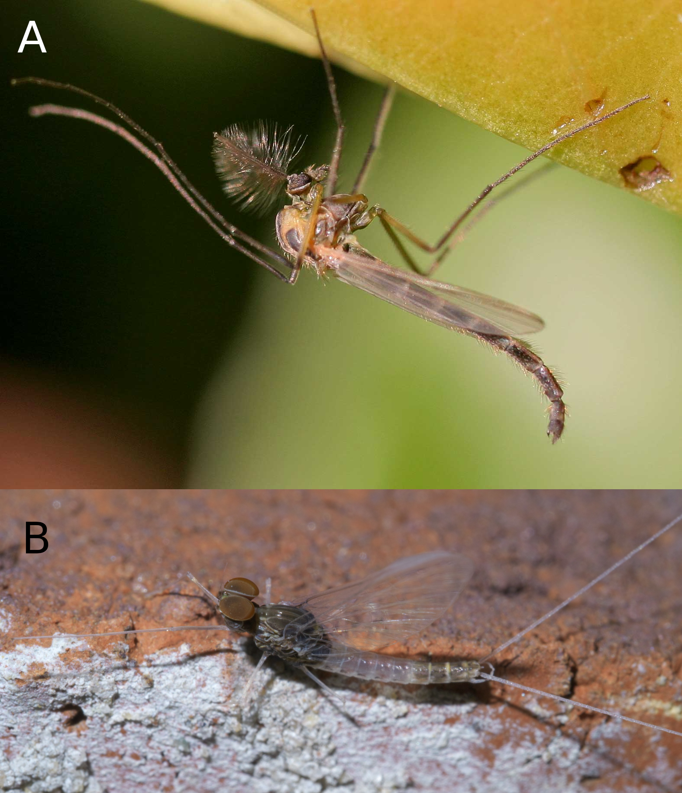

```{r setup, message=FALSE, warning=FALSE, include=FALSE}
knitr::opts_chunk$set(include = T, warning=F, message=F, cache=T)
# knitr::opts_knit$set(root.dir = "..")
knitr::opts_chunk$set(error = TRUE)
```

## Tutorial overview

Biodiversity is a hot topic in the face of unprecedented global change in the 21st century.
With a publicly available dataset, [from the Turkey Lakes Watershed in Ontario, Canada](https://open.canada.ca/data/en/dataset/f9e1595d-27bb-4a6a-b94d-6b9bed7db263), we demonstrate how to quantify biodiversity quantitatively and visually using *R*.

## Learning objectives

Using historical data from a freshwater lake ecosystem, by the end of this tutorial you will be able to:

1.  Identify, calculate, and implement commonly used metrics to quantify biodiversity
2.  Understand and create figures used to display biodiversity data
3.  Analyze biodiversity change in benthic invertebrates over multiple years and disturbance levels

## Why biodiversity matters

In an ever-changing world, we are often concerned with how organisms will be able to cope with disturbances and increasingly, global climate change.
Biodiversity is the variety of life at all levels, from genes to ecosystems.
Not only is biodiversity important for ecosystems to function properly, it is also an important buffer for withstanding changing environments.
When there is high biodiversity, there is a higher chance of some organisms surviving ecosystem change due to disturbance or climate change.
Biodiversity therefore increases the resiliency of these ecosystems and the likelihood that they will be able to persist.

*We have hidden the R code that is not part of the learning objectives, but if you want to view or recreate this code, click the "Show Code" button*

```{r, include=T, message=FALSE, warning=FALSE, code_folding=T, fig.cap="Importance of biodiversity for downstream effects on ecosystem success, structure, and function. Reproduced from [@loreau2001].", out.width = "600px", fig.align='center'}
knitr::include_graphics("biodiv_scheme.png") # including an image
```

Ecologists are often interested in the effects of perturbations (e.g. disturbances like fires, logging, flooding or pollution) on biodiversity, which can yield information and context for ecosystem health.
However, boiling biodiversity down to a single metric can be difficult and incomplete depending on the goal.
With the help of the Turkey Lake dataset of benthic invertebrates, we will present you with a number of common metrics to assess biodiversity, their meaning, and how they can be visualized with the help of rank-abundance curves.

First, we will teach you how to calculate these metrics using equations and abundance data, and then we will teach you how to use the `codyn` package to calculate these biodiversity metrics quickly and easily.

You will then have the option to learn to calculate biodiversity metrics yourself using an R package `codyn`.

```{r, include=T, message=FALSE, warning=FALSE, code_folding=T, fig.cap="Species biodiversity across the globe, downloaded from the Global Biodiversity Information Facility [@GBIF]."}
library(leaflet)

prefix = 'https://api.gbif.org/v2/map/occurrence/density/{z}/{x}/{y}@1x.png?' 
# downloading global species occurrence data
style = 'style=purpleYellow.point'
tile = paste0(prefix,style)

leaflet() %>% # making an interactive map
setView(lng = 20, lat = 20, zoom = 01) %>% # setting the coordinates
addTiles() %>%  
addTiles(urlTemplate=tile) # adding our biodiversity layer
```

## Types of data typically collected

Biodiversity is a broad term, and can be difficult to quantify.
Biologists have created several standard measures of biodiversity that convey different information about ecosystems and the species living there.

Often times, biologists interested in collecting biodiversity data collect a standard set of responses (see Fig. 3).
These often include:

1.  The different kinds of species in a given area or environment
2.  The number of individuals of each species (abundance)
3.  Information about the area itself (i.e. habitat type, weather conditions, etc.)
4.  If the work involves an setting up an experiment, collecting the control vs. experimental groups as well as metrics for replication and statistical power
5.  The time frame over which the data were collected

Often this data is collected over a long period of time, which we call *time series data*.
This allows us to see how these ecosystems are changing due to some disturbance or other changing environmental condition.

```{r, include=T, message=FALSE, warning=FALSE, code_folding=T, fig.cap="Schematic of freshwater lake ecosystem demonstrating the different information biologists to collect to understand biodiversity"}
knitr::include_graphics("species_scheme.png") # adding an image
```

## Real-world biodiversity data

The Turkey Lakes watershed is located in Ontario, Canada, approximately 50 km north of Sault Ste.
Marie.
It is 10 km^2^ in area and contains a chain of 4 lakes.
The Turkey Lakes Watershed Study (see map) is an initiative by several agencies of the government of Canada, initially designed to study the effects of acid rain on forest ecosystems.

```{r include=T, message=FALSE, warning=FALSE, code_folding=T, fig.cap="Turkey Lakes watershed and catchment areas (labelled as cXX). Map reproduced from @webster2021, which features a summary of the research carried out within this watershed in the past 40 years (*circa* 2020)."}

```

From 1995 to 2009, scientists collected, identified and counted benthic invertebrates from various stream beds around the Turkey Lakes catchment.
Benthic invertebrates are small, often microscopic organisms (see Fig. 5), but form an important link between aquatic and terrestrial habitats.
They can decompose terrestrial matter such as leaves, or consume periphyton (algae and cyanobacteria) growing on rocks within their streams.
Benthic invertebrates can be a food source for aquatic animals like small fish, or terrestrial animals such as birds.

An experiment was conducted in 1997 where certain sampling sites were logged with different intensities.
We can hypothesize that the biodiversity of benthic invertebrate communities might be affected by logging because of the effects that logging has on the stream ecosystem such as increased sunlight and temperature, increased photosynthetic activity in the stream, and decreased leaf litter.
This 14 year time series allows us to look at the immediate effects of logging as well as the subsequent recovery of the stream as foliage begins to grow back.

```{r, include=T, message=FALSE, warning=FALSE, code_folding=T, fig.cap="Various benthic macroinvertebrates under a stereo microscope [@EPA]"}
knitr::include_graphics("benthicmacroinvertebrates_g.carter_noaa600px.jpg") # include image
```

### Data collection and structure

These data are from the Turkey Lakes watershed experiment.
This dataset contains the abundances of benthic invertebrate species measured in the May and June from 1995 to 2001.
A surber sampler (see video below) was used to collect invertebrates from stream beds.

```{=html}
<style>

.vembedr iframe {
  height:398px;
}
</style>
```
```{r code_folding=T, include=T, warning=FALSE, message=FALSE, cache=FALSE}
pacman::p_load("vembedr") # load package for including video
embed_url("https://www.youtube.com/watch?v=BNrc9YkPpfA") %>%
  use_bs_responsive()
```

Several catchments within the watershed were sampled at ten sites each (for replication).
In 1997, some catchments were logged with varying harvest intensities (low, medium, and high).

First, we will subset the data, clean and process it in order to visualize and compare rank-abundance curves.
Later in the tutorial, we will using the subsetted data with the `codyn` package to analyze the diversity of these benthic invertebrates over time.

### Downloading and tidying the data

The data "TWL_invertebrateDensity.csv" from the [Government of Canada "Open Government" Portal on the "Turkey Lakes Watershed" page](https://open.canada.ca/data/dataset/576f1b52-3fce-497e-8e4c-0899acfdca1f) can be downloaded and saved as a `data.frame` object using the `read.csv` function.
We can look at all the columns of the dataset using the `colnames()` function.

```{r loadDataReal, include=F}
df.read <- read.csv(file="Data/TLW_invertebrateDensity.csv") 
```

```{r}
# load Turkey Lakes invertebrate density data 
# from the Govornament of Canada website
df.read <- read.csv(file="https://ftp.maps.canada.ca/pub//nrcan_rncan/Forests_Foret/TLW/TLW_invertebrateDensity.csv") 

# Or, if that doesn't work, from our GitHub:
if(!exists("df.read")) { 
  df.read <- 
  read.csv("https://raw.githubusercontent.com/Living-Data-Tutorials/website/main/_lessons/2022-08-26-species-richness-rank-abundance-curves/Data/TLW_invertebrateDensity.csv")
} 
```

Now, take a look at the column names:

```{r}
colnames(df.read) 
```

As you can see, the columns of the dataset are:

-   Catchment number.
    There are 11 catchments (stream study areas), and each has an alphanumeric code.

-   Year and month that the data was collected.

-   A number for the replicate (there are 10 replicates for each sampling date, which means they counted the abundances of benthic invertebrates from ten sites within each catchment on each sampling date).

-   A column for each of the species with their densities.
    Densities in units of individuals per m^2^ were calculated by dividing the counts by the area of the surber sampler (see video above; 0.32 m^2^ in this case).

First, in order to quantify biodiversity, we will convert the species densities reported in the dataset back to the raw counts (i.e. abundances) to obtain whole numbers of individuals.
To do this, it is helpful to transform the "wide" format `data.frame` (where each species is a column) to "long" format, where species names are all found in a single column using the `tidyr::pivot_longer()` function.

```{r}
library(dplyr)
df.count <- 
  df.read %>% 
  # Convert from wide to long format to simplify the operation
  tidyr::pivot_longer( 
    # Select the columns we want in long format 
    #  (i.e. the columns with invertebrate species)
    "Aeshna":"Trichoptera", 
    # Name the column that we are creating for 
    #  the names of the invertebrate species
    names_to = "Species", 
    # Name the column that we want the density values to do to
    values_to = "Density" ) %>% 
  mutate(
     # Change densities to counts
    Count = Density * 0.33,
    # Replace NAs with 0 because NA 
    #  signifies species absnce
    Count = tidyr::replace_na(Count, 0) 
    )
```

```{r panelset, echo=FALSE, include=FALSE}
xaringanExtra::use_panelset()
```

## Metrics of biodiversity {.panelset}

> ⚠️ If you plan on using metrics of biodiversity, we recommend using Hill numbers for your analysis.
> See @roswell2021.
> Although Hill numbers are outside the scope of this tutorial, understanding the biodiversity metrics presented here will help you understand Hill numbers as well.

There are several different ways to analyse and understand changes in community composition, or the relative abundances of all taxa in a community.
Each of these metrics allow us to look at different aspects of the biodiversity data we collect [@macdonald2016].

1.  **Species richness** quantifies the number of different species in a community.
2.  The **Shannon-Weiner Index** (Shannon for short) estimates species diversity by taking into account the number of species living in a habitat (richness) and their relative abundance (evenness).
3.  **Simpson's Diversity Index** also takes into account species richness and evenness, but puts more emphasis on evenness (i.e. rare species).
4.  **Evenness Indexes** assesses the evenness of the abundances of each species.

Each of these metrics can be calculated by hand using an equation.
Click through the tabs to learn how to calculate these different measures of biodiversity mathematically and using `R`!

::: panelset
::: panel
### *Species richness* {.panel-name}

Perhaps the simplest measure of biodiversity is species richness ($S$).

The equation for species richness is:

$S = \sum_{i=1}^{S}p_i^o$

$p_i^o$ represents the proportion of individuals of species $i$, taking the sum across each of these species.

**Step 1:** Count the number of unique species recorded in that year.
Then you can look at how the number of different species in a community changes over time.

**Interpretation:** A higher number means there are more species, and therefore species richness is higher.

```{r, code_folding=T, include=T, warning=FALSE, message=FALSE, cache=FALSE}
#loading necessary libraries (kableExtra makes tables)
pacman::p_load(kableExtra) # load package for making table
richness_table <- df.count %>%
  # Removing species that had 0 observations
  filter(Count > 0,
         year %in% c(1995, 1997, 2001, 2009)) %>%
  group_by(year) %>%
  summarise(richness=length(unique(Species)), # counting the number of species that were observed in each year
            # Check how many catchments were sampled in each year
            catchments = length(unique(catchment)))
#Nice looking table using the kable() function
kable(richness_table, col.names=c("Year", "Richness", "Catchments Sampled"), align="c")%>%
  kable_classic(full_width = F, html_font = "Cambria")
```

We can see in this table that across years, the number of species in the same area fluctuated.
However, this metric is particularly sensitive to changes in sampling efforts because additional sampling is likely to uncover additional, rare species.
As a result, the only reliable comparison is between 1997 and 2001, which suggests that species richness increased following the logging operations of 1997.
However, this does not tell us anything about how the abundances of different species changed.
:::

::: panel
### Shannon (H') {.panel-name}

Another metric we can use to analyze biodiversity is the Shannon-Wiener Index ($H$), which indexes across the sum of all relative proportions of species richness with an additional logarithmic transformation.
This equation takes into account both the number of species in a specific area (richness) and relative abundances (evenness).

The equation for the Shannon-Weiner Index is:

$$
H' = - \sum_{i=1}^{S}p_i~\ln(p_i)
$$

**Step 1:** Calculate $p_i$ for each species.

$$
p_i = n_i/N
$$

Where $n_i$ is the number of individuals of species $i$ and $N$ is the total number of individuals in the community.

**Step 2:** Multiply the proportion of each species ($p_i$) by the natural logarithm of the proportion ($\ln(p_i)$)

**Step 3:** Sum each of these values for each species.

**Step 4:** Multiply the sum by -1.

**Interpretation:** The minimum value of the Shannon's diversity index is 0, which means that there is no diversity (i.e. only one species is found in that habitat).
The values increase as the number of species increase, and is maximized at a given number of species when is an equal abundance of each species.

```{r, code_folding=T}
shannon <- 
  df.count %>%
  filter(year %in% c(1995, 1997, 2001, 2009)) %>%
  # Summarise over catchments and replicate sites
  group_by(year, Species) %>%
  summarise(TotalCount=sum(Count)) %>% 
  mutate(
    # Step 1
    # Note that sum(TotalCounts) calculates the "N"
    # for each year separately because the data.frame 
    # was previously grouped by year using the
    # function group_by().
    pi = TotalCount/sum(TotalCount), 
    # Step 2
    pi_ln_pi = pi*log(pi)) %>%       
  # Steps 3 & 4. 
  # Note that na.rm = T because for species abundances = 0, 
  # p_i * log(p_i) = 0 * -Inf = NaN
  summarise(shannon = -1*sum(pi_ln_pi, na.rm=T))

kable(shannon, col.names=c("Year", "Shannon's Index"), align="c")%>%
  kable_classic(full_width = F, html_font = "Cambria")
```

We can see that the Shannon diversity changes over time, with the lowest value being the year of the forest harvesting operations (1997).
However, it seems that biodiversity quickly recovers in the years following the harvesting.
:::

::: panel
### Simpson (D) {.panel-name}

Another metric we can use to analyse biodiversity in the Simpson's index ($D$) which indexes across the sum of all relative proportions of species richness with an additional square power transformation.
Though very similar to the calculation in the Shannon-Wiener Index, the Simpson index is more focused on dominance of species as it highlights the proportion of species in a sample.

The equation for Simpson's diversity is:

$$D = 1-\sum_{i=1}^{S} \frac {n_i(n_i-1)}{N(N-1)}$$

Where $n_i$ is the number of individuals of species $i$ and $N$ is the total number of individuals in the community.

**Step 1:** Multiply the number of individuals of a given species ($n_i$) by ($n_i-1$).

**Step 2** Multiply the total number of individuals in the community ($N$) by ($N-1$).

**Step 3:** Divide the number from step 1 by the number from step 2.

**Step 4:** Once you have the numbers from step 3 for each species in the community, sum all of these together and substract from 1.

**Interpretation:** The higher the value of $D$, the greater the diversity in the community.
An index close to 1 means that there are several species in the community, and the population proportion of species is even.
On the other hand, $D=0$ indicates a single-species community

```{r, code_folding=T}
simpson <-  df.count %>%
  filter(year %in% c(1995, 1997, 2001, 2009)) %>%
  # Summarise over catchments and replicate sites
  group_by(year, Species) %>%
  summarise(TotalCount=sum(Count)) %>%
  mutate(
    # Step 1
    num = TotalCount*(TotalCount - 1 ),
    # Step 2 (Note: data.frame grouped by year)
    denom = sum(TotalCount)*(sum(TotalCount)-1), 
    # Step 3
    frac = num/denom) %>% 
  # Step 4
  summarise(simpson = 1 - sum(frac))

kable(simpson, col.names=c("Year", "Simpson's Index"), align="c")%>%
  kable_classic(full_width = F, html_font = "Cambria")
```

Similarly to the Shannon-Weiner index, biodiversity dropped in 1997, but had recovered by 2001.
:::

::: panel
### Evenness (E) {.panel-name}

Additionally, we can think about the evenness of species across a given area.
Evenness is a type of metric for assessing species dominance.
If evenness is high, it means most species are of equal dominance.
If evenness if low, it means some species are more dominant (i.e. have higher abundance) than others.
Evenness is maximized when all species have equal abundances.
Multiple metrics can be used to measure evenness, here we show an example of "Shannon-Wiener" evenness, however a similar approach can be used for simpson evenness.

The equation for "Shannon-Wiener" evenness is:

$E = H / ln(S)$

**Step 1:** Divide the value of the Shannon-Wiener index ($H$) by the species richness ($S$).

**Interpretation:** Values closer to one signify more evenness and values closer to 0 signify lower evenness.

```{r, code_folding=T}
# Combine previously calculated species richness 
#  and shannon index tables
evenness = 
  left_join(richness_table, shannon) %>%
  # Step 1
  mutate(evenness = shannon/log(richness)) %>%
  select(year, evenness)

kable(evenness, col.names=c("Year", "Evenness"), align="c")%>%
  kable_classic(full_width = F, html_font = "Cambria")
```

As with previous biodiversity metrics, we find that evenness is lowest in 1997, and recovers in the following years.
:::
:::

## Visualizing biodiversity

Apart from calculating biodiversity using the metrics above we can also visualize differences using plots.

One way to visualize biodiversity data is to make a rank-abundance curve.
On the y-axis we have the species (numbered), and on the y axis we have the abundance.
The plots are organized from high to low abundance.
Using rank-abundance curves, we can visualize the change in relative abundance and species dominance over time.

As an example, we use a subset of the Turkey Lakes data with six of the more abundant species from the dataset to make a simple rank-abundance curve.

```{r, code_folding=T, fig.cap="Simple rank-abundance curve with 6 species from the Turkey Lakes dataset, with counts from 1995 and 2001. Colour and shape indicate a unique species, with y axis representing abundance."}
#loading necessary libraries
pacman::p_load(tidyverse, patchwork)
#creating a subset of the full data with just 6 species, across 4 years
subset <- df.count %>%
  filter(Species %in% c("Chironomidae", "Prosimulium", "Baetis", "Heterocloeon", "Chelifera", "Leuctra")) %>%
  filter(year %in% c(1995, 1997, 2001, 2009)) %>%
  group_by(year, Species) %>%
  summarise(sum=sum(Count))

#1995
a<- subset %>%
  filter(year==1995) %>%
ggplot(aes(x=reorder(Species, -sum), y=sum, shape=Species, colour=Species))+
  geom_point(size=4)+
  scale_colour_viridis_d()+
  ggtitle("1995")+
  theme_classic()+
  labs(x="Species", y="Abundance", color="Species")+
  theme(axis.text.x = element_text(face="italic"), legend.position="none") # Use italics for species names


#2001
b<- subset %>%
  filter(year==2001) %>%
  ggplot(aes(x=reorder(Species, -sum), y=sum, shape=Species, colour=Species))+
  geom_point(size=4)+
  scale_colour_viridis_d()+
  ggtitle("2001")+
  theme_classic()+
  labs(x="Species", y="Abundance", color="Species") +
  theme(axis.text.x = element_text(face="italic"), legend.position="none") # Use italics for species names


a / b
```

We can see here between 1995 and 2001 in our benthic community, there were small differences in absolute counts, with the most abundant species (*Chrironomidae*) decreasing \~5000 in abundance of individuals, but still remaining the most abundance species overall across both years.
*Chironomidae* are often very abundant in streams, and are good at taking advantage of the benefits that may be provided by logging, such as increased sunlight availability causing an increase in photosynthetic activity and increased periphyton (algae), which is their primary food source.
Overall abundance of all species decreases in 2001 compared to 2005, likely because of the regrowth of foliage after logging and decrease in photosynthetic activity in the stream.
*Baetis* was the 2nd most abundant species in 1995, but dropped to 5th most abundant by 2001.
This suggests that this species may do better immediately following disturbance.
However, we would need to look at data from more years to draw conclusions.

```{r, include=T, message=FALSE, warning=FALSE, code_folding=T, fig.cap="A) *Chironomus plumosus*, a type of chironomid, also called nonbiting midges, or lake flies [@wiki:Chironomidae]. B) *Baetis intercalaris*, a type of mayfly, also known as blue-winged olives [@wiki:Baetis].", out.width = "787px", fig.align='center'}

```

### Rank abundance curves with Turkey Lakes invertebrate data {.panelset}

The Turkey Lakes dataset spans multiple years, months, and catchments within the Turkey Lakes watershed and includes densities for a wide array of invertebrate species across multiple replicate sites.
Each site has an alphanumeric code.

You can visualize Rank Abundances for any subset of the dataset using the following [**Shiny App**](https://ekatko1.shinyapps.io/TurkeyLakesInverts/){target="_blank"}.

::: panelset
::: panel
#### Additional data wrangling {.panel-name}

Using information obtained from the [metadata of this dataset](https://ftp.maps.canada.ca/pub//nrcan_rncan/Forests_Foret/TLW/TLW_invertebrate_metaEN.csv), we can add some interesting details to the data (for at least a few catchments and years).
For the purposes of this portion of the tutorial, we also select a different subset of the data to work with.

```{r code_folding=T, include=T, warning=FALSE, message=FALSE, cache=FALSE}
## Different catchments had different logging intensities
treatment = tibble(catchment =             c("34M",  "34U",    "34L"),
                   `Logging Intensity`   = c("none", "medium", "high"))

## Logging happened in 1997
yearAnnot = tibble(
  year = 1995:2001,
  trt  = c( rep("pre-logging", 2), "logging", rep("post-logging", 4))
)

df.subset =  
  df.count %>%
    right_join(treatment) %>%
    right_join(yearAnnot) %>%
  filter(month %in% c("june", "may"))
```

Then, we will clean up the data by removing any species whose count is zero across all the different sites and years.

```{r code_folding=T, include=T, warning=FALSE, message=FALSE, cache=FALSE}
## Find species that have 0 abundance across all sites and years.
NA_sp = df.subset %>%
  group_by(Species) %>%
  summarize(Count = sum(Count, na.rm=T)) %>%
  filter(Count==0) %>%
  select(Species)

## Remove those species from the dataset
df.clean = df.subset %>% 
  anti_join(NA_sp)

```
:::

::: panel
#### Summarise data {.panel-name}

Let's start by looking at catchment "34L", which saw high levels of deforestation in June of 1998, the year following the logging event.

```{r code_folding=T, include=T, warning=FALSE, message=FALSE, cache=FALSE}
df.subset1 <- df.subset %>% 
  filter(catchment == "34L", # high loggineg
         year      == 1998,
         month     == "june")
```

Next, we can sum the count data over all the replicate sites within the catchment to obtain a total count within the catchment.

```{r code_folding=T, include=T, warning=FALSE, message=FALSE, cache=FALSE}
df.raw.summary1 = 
  df.subset1 %>%
  group_by(Species) %>%
  summarise(
    TotalCount = sum(Count))
```

Then, we order the species from most abundant to least abundant.

```{r code_folding=T, include=T, warning=FALSE, message=FALSE, cache=FALSE}
df.ordered.summary1 = 
  df.raw.summary1 %>%
  arrange(desc(TotalCount)) 
```

Finally, we assign a rank to the species (rank 1 = the most abundant species) and filter out any species which are not actually present in this catchment.

```{r}
df.summary1 = 
  df.ordered.summary1 %>%            
  mutate( Rank = seq_along(Species) ) %>%  
  # Keep only species with abundances greater than zero.
  filter(TotalCount > 0)                   
```
:::

::: panel
#### Plot the data {.panel-name}

We make a plot to represent the data.
Note that we need to use the `stats::reorder()` function to get the species on the x-axis in the correct order:

```{r, code_folding=T, fig.cap="Abundance of species in catchment 34L of the Turkey Lakes in June 1998"}
library(ggplot2)
plot1 = 
  df.summary1 %>%
  ggplot(aes(x=reorder(Species, -1*TotalCount), 
             y=TotalCount)) + 
  geom_col() +
  xlab("Taxon") +
  ylab("Total count (sum of replicates)") + 
  theme_classic(base_size=16) +  # Aesthetic
  theme(axis.text.x = element_text(face="italic", size=9, angle=90)) # Use italics for genus names
plot1
```

As you can see, rank-abundance curves in nature are rarely as evenly distributed as the simulated data.
There is often few highly abundant species and many very rare species.
As a result, a log transform is frequently applied to the y-axis.
Additionally, when analyzing rank-abundance curves, the focus is on the shape of the curve, not on the species names.
As a result, we can substitute the species name with it's rank.
This is where the term *rank*-abundance comes from.
This also has the added benefit of simplifying the code:

```{r, code_folding=T, fig.cap="Abundance of species in catchment 34L of the Turkey Lakes in June 1998"}
df.summary1 %>%
  ggplot(aes(x=Rank, y=TotalCount)) + 
  geom_col() +
  xlab("Rank") +
  scale_y_log10() + 
  ylab("log Total count") + 
  theme_classic(base_size=16) # Aesthetic
```
:::
:::

### Comparing rank-abundance curves {.panel-name}

Instead of using bars to represent abundances, we can simply use lines to trace the distribution.
This allows us to compare multiple distributions.
First, let's compare the different replicates (i.e., sites) within a single catchment area (34L).

```{r, code_folding=T, fig.cap="Comparison of rank-abundance curve changes across different sites (replicate)"}
df.subset1 %>%
  group_by(replicate) %>% 
  # Order by rank, for each catchment (.by_group=T)
  arrange(desc(Count), .by_group = T) %>%
  mutate( Rank = seq_along(Species) ) %>%  
  # Keep only species with abundances greater than zero.
  filter(Count > 0) %>%
  # Line Plot
  ggplot(aes(x=Rank, y=Count, color=as.factor(replicate))) + 
    xlab("Rank") + 
    ylab("log Count") + 
    geom_line(size=2) + 
    scale_y_log10() +
    # Some aesthetic choices:
    theme_classic(base_size=16) +
    scale_color_brewer(name = "Site", palette = "Paired")
  
```

Here, the y-intercept of the line represents the abundance of the most abundant species.
The slope represents the evenness of the rank abundance curve.
A steeper slope means that the site is more dominated by one or two species, while a less steep slope means the abundances are more even between species.
A slope of 0 would represent complete evenness among samples.
The x-intercept represents how many species are in the sample (i.e. species richness).
This is also called the highest maximum rank.
The site with the highest maximum rank here is site 6.

Notice that there is some variation in the shape and the "evenness" (i.e., slope) of the different rank-abundance curves.

In the plot above we are showing different sites separately from one catchment, but we can pool the samples from the 10 sites in each catchment and compare catchments to one another.
This allows us to compare rank-abundance curves from three different catchments, each of which has a different logging intensity.

Here are the rank abundance curves for of the 3 catchments with different logging treatment.
This is only the data from 1998, which is a couple years after logging.

```{r, code_folding=T, fig.cap="Comparison of rank-abundance curve changes across sites with different logging intensity"}
plot = 
  df.subset %>% 
  # Subset
  filter( year      == 1998,
          month     == "june") %>%
  # Summarise across replicates
  group_by(`Logging Intensity`, catchment, Species) %>%
  summarise(TotalCount=sum(Count)) %>% 
  # Order by rank, for each catchment (.by_group=T)
  group_by(catchment, `Logging Intensity`) %>%
    arrange(desc(TotalCount), .by_group = T) %>%
    mutate( Rank = seq_along(Species) ) %>%
  # Keep only species with abundances greater than zero.
  filter(TotalCount > 0) %>%
  # Line Plot
  ggplot(aes(x=Rank, y=TotalCount, color=`Logging Intensity`)) + 
    xlab("Rank") + 
    ylab("log Total count") + 
    geom_line(aes(size=`Logging Intensity`)) + 
    scale_y_log10() +
    # Some aesthetic choices:
    scale_size_manual(values=c(2.5, 2, 1.5)) +
    theme_classic(base_size=16) +
    scale_color_brewer(palette="Dark2") + 
    theme(legend.position = c(0.87,0.87))
plot
  
```

First of all, you can see that when we pool all of the samples from the 10 sites in each catchment, the species richness increases.
In the first plot at the site level, the highest richness was 29, where here it is 40.

You can see that the catchment with high intensity logging had the highest species richness (highest maximum rank).
It is common for species richness to increase following a disturbance.
In this case, it is potentially because the removal of trees increased photosynthetic activity and temperature, which provided more food and a more hospitable habitat for benthic invertebrates.
Interestingly, the slope of the rank abundance curve for high intensity logging is similar to the slope of the rank abundance curve for no logging, suggesting that logging caused an increase in overall richness but did not effect evenness.
The catchment that was logged with medium intensity has a less "even" rank-abundance curve compared to the other two.
In other words, the slope is slightly steeper for the "medium" intensity site than for the "high" and "none" (no logging) catchments.
Of course, many more sites over several years need to be compared in order to make any generalizable claims about the effects of logging on invertebrate biodiversity in the Turkey Lakes area.
For more details about the effects of logging at the Turkey Lakes, see @kreutzweiser2005.

Furthermore, several models have been developed to understand rank-abundance curves (e.g. log-normal, broken stick model).
The [`radfit`](https://search.r-project.org/CRAN/refmans/vegan/html/radfit.html) function from the `vegan` *R* package allows fitting of these different curve models [@radfit].

For more information about rank-abundance curves, see [this *Nature* article](https://www.nature.com/scitable/knowledge/library/explaining-general-patterns-in-species-abundance-and-23162842/).

## Measure and visualize biodiversity with `codyn`

Now that we have calculated different biodiversity metrics and rank abundance curves by hand, we can also use existing functions in the `R` package `codyn` [@hallett2016] to quantify and visualizing changes in biodiversity with the Turkey Lakes dataset.

```{r setup2, include=FALSE, message=FALSE, warning=FALSE}
knitr::opts_chunk$set(include = T, warning=F, message=F, echo=T)
```

### Load data and packages

Along with the `codyn` package, we will also use `ggplot2`, `dplyr` and `tidyr` for plotting, cleaning, and re-formatting data.

```{r, message=FALSE, warning=FALSE}
library(ggplot2)
library(codyn)
library(dplyr)
library(tidyr)
```

Load, subset and clean the data (see "Rank abundance curves with Turkey Lakes invertebrate data" above for details) :

```{r}
data  <- 
  read.csv(file="https://ftp.maps.canada.ca/pub//nrcan_rncan/Forests_Foret/TLW/TLW_invertebrateDensity.csv") %>%
  pivot_longer( "Aeshna":"Trichoptera", names_to = "species", values_to = "density") %>%
  mutate(abundance = density * 0.33, 
         treatment = case_when(catchment %in% c("33") ~ "low", 
                               catchment %in% c("34U") ~ "medium", 
                               catchment %in% c("34L") ~ "high", 
                               catchment %in% c("34M") ~ "control", 
                               TRUE ~ "natural"), 
         date_yr_m = zoo::as.yearmon(paste0(year,month), "%Y %b")) %>%
  drop_na(abundance) %>% 
  filter(year >= 1995, 
         year <= 2001, 
         # stringr::str_starts(catchment, stringr::fixed("34")), 
         month %in% c("june", "may"))

```

For many functions, the `codyn` package can only look at data from one stream at a time.
So first we will separate each stream into it's own data frame.

```{r, message=FALSE, warning=FALSE}
# high intensity logging treatment
subset_codyn_high <- data %>%
  filter(treatment == "high")
# medium intensity logging treatment
subset_codyn_med <- data %>%
  filter(treatment == "medium")
# low intensity logging treatment
subset_codyn_low <- data %>%
  filter(treatment == "low") 
# control stream (no logging)
subset_codyn_ctrl <- data %>%
  filter(treatment=="control")
```

### Using the `codyn` package to analyze diversity data over time {.panelset}

Ecologists are often interested in how diversity changes over time in one place.
This is particularly interesting when you are looking at how species diversity responds to environmental change.
This environmental change can be a single disturbance event such as a forest fire or more long-term change such as temperature increases due to climate change.

The Turkey Lakes dataset provides us with an opportunity to look at how the diversity of benthic invertebrates changes over time and in response to logging, given that areas of the river were subjected to different levels of logging.
We can compare the diversity of different streams with different logging intensities.

The `codyn` package allows us to analyze the change in biodiversity over time using different metrics.

### Evenness

As we learned earlier, evenness is a metric which allows us to compare the abundance of rare versus rich species, or the slope of the rank-abundance curve.
`community_structure()` is a function in the package `codyn` that calculates species richness and a number of evenness metrics.

::: panelset
::: panel
### Subset data

Let's take a look at the high intensity logging stream data.

```{r}
head(subset_codyn_high)
```

As you can see, there is a column for year, species, replicate, and abundance.
:::

::: panel
### Calculate evenness {.panel-name}

We can use the `community_structure()` function to look at the change in species richness and evenness over time in one of the Turkey Lake streams.
We will choose the stream with high logging intensity as an example.
This function can only look at one stream at a time so make sure to subset out the stream that you are interested in.

The community structure function has five arguments.

1.  `df`: the data frame of interest, in our case `subset_codyn_high`.

2.  `time.var`: (optional) the name of the time variable column (`year`)

3.  `abundance.var`: the name of the abundance variable column (`abundance`).

4.  `replicate.var`:(optional) the name of the replicates column (`replicate`)

5.  `metric`: the evenness metric that you want the function to calculate.

There are three possible metrics: `Evar`, `SimpsonEvenness`, and `EQ`, which all calculate evenness in different ways.
We will use Simpson's evenness in this tutorial.
You can find more information about the function, and the different evenness metrics by typing `?community_structure` into the *R* console.

```{r class.source = 'fold-show'}
richness_high <- community_structure(
  df=subset_codyn_high, 
  time.var="year", 
  abundance.var="abundance", 
  replicate.var="replicate", 
  metric="SimpsonEvenness")

head(richness_high)
```

As you can see, `community_structure()` returns a data frame with species richness and evenness for each year and replicate.
It is possible to calculate a measure of variability for each year since we have multiple replicates.
We leave this as an exercise for the reader.
:::

::: panel
#### Plot species richness

We can plot this data frame to see the changes over time.

```{r, code_folding=TRUE, fig.cap="Species richness of aquatic macroinvertebrates over time. Each point is a replicate"}
pacman::p_load(png, grid, ggplot2)
img <- readPNG("logging.png")
g <- rasterGrob(img, interpolate=TRUE)


ggplot()+
  geom_vline(xintercept=1997, linetype=2, color="red", size=2)+
  geom_point(richness_high, mapping=aes(x=year, y=richness), alpha=0.5)+
  geom_pointrange(richness_high, mapping=aes(x=year, y=richness), size=2, stat="summary")+
  theme_classic()+
  labs(y="Species Richness", x="Year")+
   annotation_custom(g, xmin=1996.5, xmax=1997.5, ymin=20, ymax=30)
```

Here is a plot of species richness, with a different value for each replicate.
The red line is the year that the streams were logged.
Do you see any change?
Do you think there are any significant patterns?
How does the variability between replicates compare to the variability between years?
:::

::: panel
#### Plot evenness

We can also plot species evenness over time.

```{r, code_folding=TRUE, fig.cap="Species evenness of aquatic macroinvertebrates over time. Each point is a replicate"}

ggplot()+
  geom_vline(xintercept=1997, linetype=2, color="red", size=2)+
  geom_point(richness_high, mapping=aes(x=year, y=SimpsonEvenness), alpha=0.5)+
  geom_pointrange(richness_high, mapping=aes(x=year, y=SimpsonEvenness), size=2, stat="summary")+
  theme_classic()+
  labs(y="Species Evenness", x="Year")+
   annotation_custom(g, xmin=1996.5, xmax=1997.5, ymin=0.57, ymax=0.75)
```

Do you see any patterns in the evenness between years?
:::
:::

### Biodiversity metrics

Species richness and evenness are very effective ways to simplify highly complex biodiversity datasets.
However, as you learned from the rank abundance curves, species have different abundances within the community, with some species having very high abundance and most species having low abundance.
As a result, it is difficult to precisely estimate species richness, since more species can often be uncovered by additional sampling.
The Shannon-Weiner diversity metric addresses this shortcoming to some extent by taking species abundance into account, which allows us to make more meaningful inferences about how biodiversity is changing over time.
The `codyn` package allows us to calculate the Shannon diversity index for a single site over time using the `community_diversity()` function.

::: panelset
::: panel
### Calculate Shannon diversity

We will again use the data from the stream with the high logging intensity.
Luckily, this function has the exact same syntax as the `community_structure()` function!
The only difference is that the options for the `metric` argument are `Shannon` and `InverseSimpson`.

We will first use `Shannon`, which gives more weight to species richness, as opposed to evenness.

```{r class.source = 'fold-show'}
shannon_div_high<-
  community_diversity(
    df=subset_codyn_high, 
    time.var="year", 
    abundance.var="abundance", 
    replicate.var="replicate", 
    metric="Shannon")
```

Let's take a look at the output for this function.

```{r}
head(shannon_div_high)
```

You can see it gives us a data frame of `year`, `replicate`, and `Shannon`, which is our measure of Shannon diversity.
:::

::: panel
### Plot Shannon diversity

```{r, code_folding=TRUE, fig.cap="Shannon's diversity of aquatic macroinvertebrates over time. Each point is a replicate."}
ggplot()+
  geom_vline(xintercept=1997, linetype=2, color="red", size=2)+
  geom_point(shannon_div_high, mapping=aes(x=year, y=Shannon), alpha=0.5)+
  geom_pointrange(shannon_div_high, mapping=aes(x=year, y=Shannon), size=2, stat="summary")+
  theme_classic()+
  labs(y="Shannon Diversity", x="Year")+
   annotation_custom(g, xmin=1996.25, xmax=1997.75, ymin=2.22, ymax=2.5)


```
:::
:::

::: panelset
::: panel
### Calculate Simpon diversity

We can also use the same function to calculate Simpson's diversity by simply changing the `metric` argument to `InverseSimpson`.
Simpson diversity gives more weight to species evenness, as opposed to species richness.

```{r class.source = 'fold-show'}
simpson_div_high <- 
  community_diversity(
    df=subset_codyn_high, 
    time.var="year", 
    abundance.var="abundance", 
    replicate.var="replicate", 
    metric="InverseSimpson")
```

We can look at the output.

```{r}
head(simpson_div_high)
```
:::

::: panel
### Plot Simpson diversity

And then plot.

```{r, code_folding=TRUE, fig.cap="Simpson's diversity of aquatic macroinvertebrates over time. Each point is a replicate"}
ggplot()+
  geom_vline(xintercept=1997, linetype=2, color="red", size=2)+
  geom_point(simpson_div_high, mapping=aes(x=year, y=InverseSimpson), alpha=0.5)+
  geom_pointrange(simpson_div_high, mapping=aes(x=year, y=InverseSimpson), size=2, stat="summary")+
  theme_classic()+
  labs(y="Simpson Diversity", x="Year")+
   annotation_custom(g, xmin=1996.5, xmax=1997.5, ymin=8, ymax=10)


```

How do these patterns compare to the patterns of Shannon's diversity over time?
How do the values compare?
:::
:::

### Activity

Calculate richness, evenness, and diversity using both the Shannon and Simpson indices for the streams with low intensity logging, high intensity logging, and no logging.
The data for these streams are `subset_codyn_low`, `subset_codyn_high`, and `subset_codyn_ctrl`.
Plot these indices.
Do you see any patterns across years?
How do these compare to the patterns in the high intensity logging stream?

## Conclusion

In this tutorial, we learned how to go about understanding patterns of biodiversity graphically (e.g., rank-abundance curves), and using metrics (e.g., species richness, Shannon index, Simpson's index, Evenness index(es)).
We first calculated metrics without using specialized `R` packages, and then used the `codyn` package to do the same thing more easily.
Since we don't perform any formal statistical analysis in this tutorial, we cannot make any scintific claims about the effect of logging on invertebrate biodiversity in the Turkey Lakes watershed.
Nevertheless, our preliminary analysis do not lead us to believe that there is a great effect of logging.
We encourage you to think of alternative ways to look at the data that may yield different results.
Indeed, because of the wealth of data, combined with different metrics and considerations, there is no single "best" way to analyse this type of data.
However, multiple different analysis can allow one to have a more complete understanding of the patterns of biodiversity.
